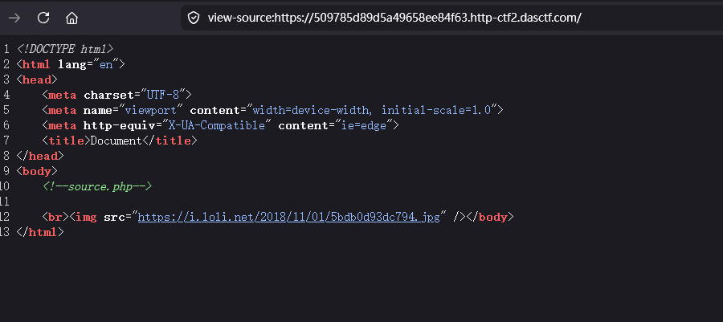
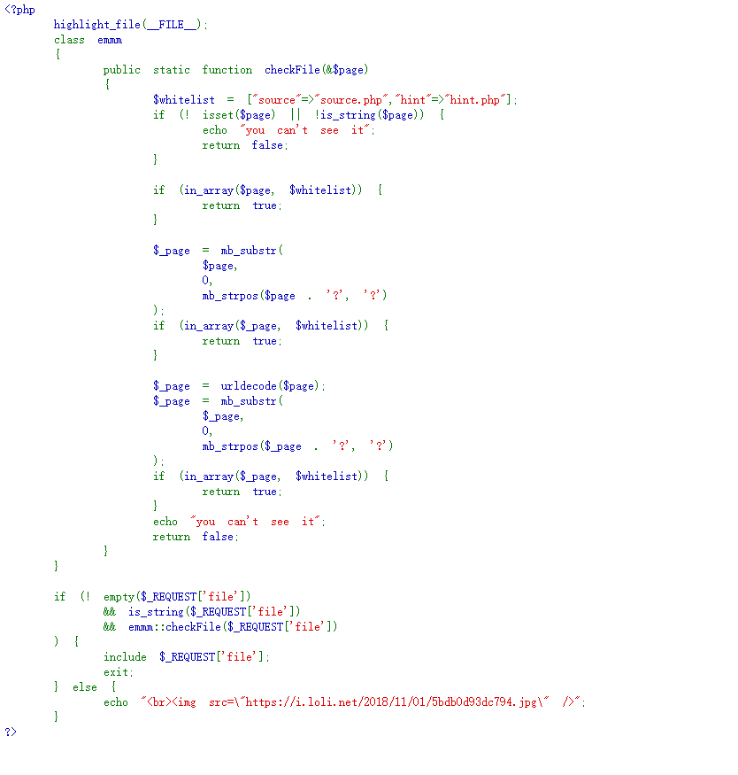

# [HCTF 2018]WarmUp

## 题目来源
[HCTF 2018]WarmUp

## 题目方向 + 知识点
Web 文件包含、白名单校验绕过、`include` 路径解析差异、`?./` 绕过技巧。

## 解题思路
这题打开首页后，页面非常干净，只留下了一个注释 `<!--source.php-->`。这类信息一般不是无意义装饰，往往就是出题人主动给的突破口，所以我第一步直接访问 `/source.php` 看源码。



拿到源码之后，核心逻辑很清楚：



表面上看它已经限制得很死，但问题出在校验和真实包含使用的不是同一个路径。`checkFile()` 会先尝试把参数按 `?` 截断，然后只拿 `?` 前面的部分和白名单比较：

```php
$_page = mb_substr($page, 0, mb_strpos($page . '?', '?'));
if (in_array($_page, $whitelist)) {
    return true;
}
```

这所以我们读代码先绕过前面的checkfile()；但后面的 `include $_REQUEST['file']` 用的却还是完整参数。这里就出现了典型的“校验对象”和“执行对象”不一致。

接着我访问 `?file=hint.php`，页面回显了提示：

```text
flag not here, and flag in ffffllllaaaagggg
```

这句话直接告诉我 flag 不在当前目录，而是在一个名为 `ffffllllaaaagggg` 的文件里。所以剩下的问题就变成：怎样在通过白名单的同时，把包含路径指向这个文件。

构造payload传入：

```text
?file=source.php?/../../../../ffffllllaaaagggg
```

可以绕过source.php的同时

include source.php?/../../../../ffffllllaaaagggg

它会根据

source.php?/

../

../

../

../

ffffllllaaaagggg

找下去  但是没找到 我们逐层遍历 最后五层上溯找到flag

```text
?file=source.php?./../../../../../ffffllllaaaagggg
```


## Flag
`CTF2{6996f54b-c427-42fb-a2d0-13539d4b3420}`