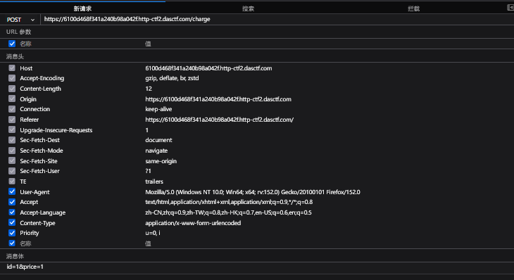
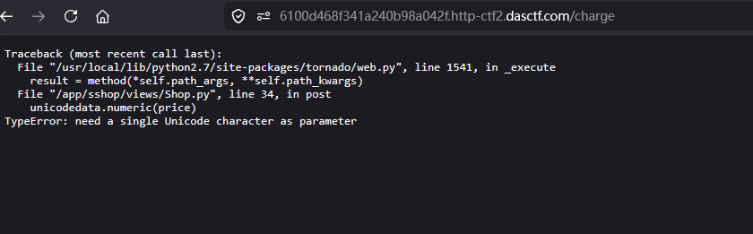

# [ASIS 2019]Unicorn shop

## 题目来源

[ASIS 2019]Unicorn shop

## WEB

参数校验绕过、Unicode 数字字符、PHP 数值判断差异、单字符输入限制绕过。

## 解题思路

我先打开首页，页面是一个购买独角兽商品的小商城，商品列表里最贵的一件是：

- `id=4`
- `price=1337.0`

页面底部有一个购买表单，向 `/charge` 提交两个 POST 参数：

- `id`
- `price`
- 

源码注释里还给了几句明显的提示：

```html
<!--Ah,really important,seriously. -->
<!-- Don't be frustrated by the same view,we've changed the challenge content.-->
<!--We still have some surprise for admin.password-->
```

这些提示虽然没有直接给 payload，但能看出来题目重点不是页面展示，而是“输入值本身的特殊性质”，尤其是第一句 `really important`，很像在暗示字符编码或字符类别问题。

我先按最正常的方式尝试购买第一件商品：

```text
id=1
price=2.0
```

结果页面提示：

```text
操作失败。
Only one char(?) allowed!
```

这说明后端对输入有一个非常苛刻的限制：价格字段大概率只允许“一个字符”，而 `2.0` 这种普通价格字符串长度太长，所以会被拦截。

为了继续确认逻辑，我又尝试：

```text
id=1
price=1
```

页面这次提示：

```text
操作失败。
Wrong commodity!
```

这一步说明：

1. 单字符输入是能通过第一层长度检查的。
2. 但数值 `1` 并不等于商品 `id=1` 的实际价格 `2.0`，所以后端继续进入了商品价格比对，并返回 `Wrong commodity!`。

接着我又测试了最贵商品：

```text
id=4
price=1337.0
```

这次依旧是：

```text
Only one char(?) allowed!
```

目标商品价格是 `1337.0`，但后端又只允许价格参数使用“一个字符”。如果只从 ASCII 数字里选，一个字符根本不可能表示 1337，



同时如果不输入price 会显示上面

因此这里就必须考虑“一个字符但数值很大”的 Unicode 数字字符。

想到这里，我开始测试一些单个 Unicode 数字字符。像罗马数字、特殊数字字符，在很多语言或库里会被识别成合法数值，虽然它们表面上只占一个字符。最终我使用了：

```text
ↁ
```

这个字符在 Unicode 中表示一个较大的数值，能够满足价格比较，同时长度上又只算作一个字符，刚好绕过题目的“Only one char”限制。

我实际提交的请求是：

```text
POST /charge
id=4&price=ↁ
```

为了请求稳定发送，HTTP 中实际使用了 URL 编码版本：

```text
id=4&price=%E2%86%81
```

访问后页面返回：

```text
操作成功。
CTF2{db94f8f2-a31a-4cfa-9323-51f27ab631f1}
```

我随后又验证了另一个相近的单字符：

```text
ↂ
```


## Unicode单字符大数集合（可直接拿来构造字典）

### 1）CJK 中文大数（最实用）	

| 字符 | CodePoint | 数值                                    |
| ---- | --------- | --------------------------------------- |
| 万   | U+4E07    | 10⁴                                     |
| 亿   | U+4EBF    | 10⁸                                     |
| 兆   | U+5146    | 10¹²（中制；注意日台语境兆 = 10¹⁶歧义） |
| 京   | U+4EAC    | 10¹⁶                                    |
| 垓   | U+5793    | 10²⁰                                    |
| 秭   | U+79ED    | 10²⁴                                    |
| 穰   | U+7A70    | 10²⁸                                    |
| 沟   | U+6C9F    | 10³²                                    |
| 涧   | U+6DA7    | 10³⁶                                    |
| 正   | U+6B63    | 10⁴⁰                                    |
| 载   | U+8F7D    | 10⁴⁴                                    |

### 2）古罗马单字符大数（Number Forms U+2160–2188）

表格

| 字符 | CodePoint | 值     |
| ---- | --------- | ------ |
| ↀ    | U+2180    | 1000   |
| ↁ    | U+2181    | 5000   |
| ↂ    | U+2182    | 10000  |
| ↇ    | U+2187    | 50000  |
| ↈ    | U+2188    | 100000 |

## Flag

`CTF2{db94f8f2-a31a-4cfa-9323-51f27ab631f1}`